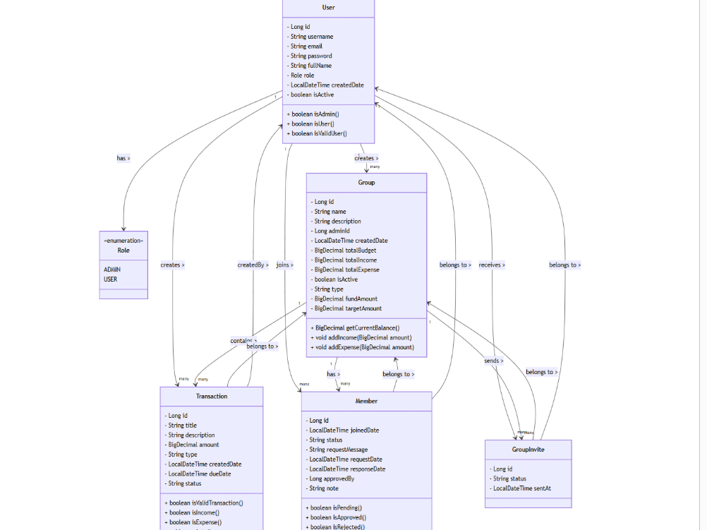
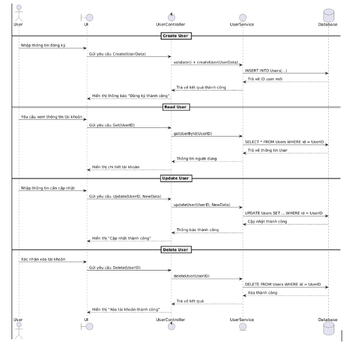
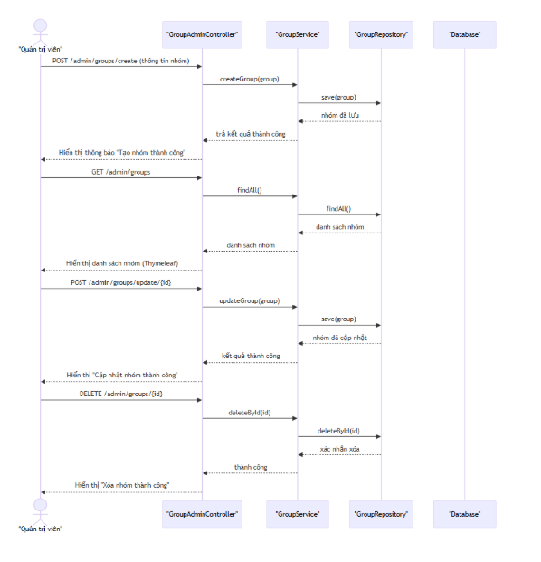

# 00P_N04_25_26_KhuongDuy_HongThai
# 💰 Fund Manager – Ứng Dụng Quản Lý Ngân Sách Nhóm

## 🧩 Giới thiệu
*Fund Manager* là ứng dụng web giúp người dùng quản lý thu chi nhóm một cách minh bạch, tiện lợi và hiệu quả.  
Ứng dụng cho phép tạo nhóm, gửi lời mời, ghi nhận giao dịch, thống kê chi tiêu, và theo dõi quỹ nhóm theo thời gian thực.

---

## 🚀 Tính năng chính

### 👑 Dành cho Admin
- Tạo và quản lý nhóm, gửi lời mời thành viên.  
- Quản lý giao dịch thu/chi, phê duyệt hoặc từ chối giao dịch.  
- Theo dõi báo cáo tổng hợp, thống kê và biểu đồ tài chính.  
- Quản lý thành viên và phân quyền người dùng.  

### 👥 Dành cho User
- Đăng ký, đăng nhập, tham gia nhóm qua mã hoặc lời mời.  
- Theo dõi giao dịch, đóng góp, và xem lịch sử thu chi cá nhân.  
- Xem báo cáo tổng quan và quản lý thông tin cá nhân.  

---

## 🧱 Kiến trúc hệ thống
Ứng dụng được thiết kế theo mô hình *MVC (Model – View – Controller)* giúp tách biệt logic xử lý, giao diện và dữ liệu.
---

## 👨‍💻 Thành Viên Nhóm

| Họ và tên | MSV | Vai trò |
|------------|------|----------|
| *Phạm Khương Duy* | 23010743 | Trưởng nhóm – Backend, Database, Kiểm thử |
| *Dương Hồng Thái* | 23010326 | Frontend, UI/UX, Báo cáo, Demo |


- *Model:* Lưu trữ dữ liệu người dùng, nhóm, giao dịch.  
- *Controller:* Xử lý yêu cầu và điều phối luồng nghiệp vụ.  
- *View:* Giao diện HTML hiển thị bằng Thymeleaf + Bootstrap.  

---

## 🧰 Công nghệ sử dụng

| Công nghệ / Công cụ | Vai trò |
|----------------------|---------|
| *Spring Boot* | Xây dựng backend, quản lý nghiệp vụ |
| *Thymeleaf* | Template engine render HTML |
| *Bootstrap 5* | Thiết kế giao diện người dùng |
| *MySQL (Aiven Cloud)* | Lưu trữ dữ liệu |
| *Spring Data JPA (Hibernate)* | ORM mapping |
| *Git & GitHub* | Quản lý mã nguồn |
| *draw.io / Lucidchart* | Vẽ sơ đồ UML |

---

## 🗂️ Cấu trúc thư mục dự án

project-root/
│
├─ src/
│  ├─ main/
│  │  ├─ java/
│  │  │  └─ com/oop/quanlyngansach/
│  │  │     ├─ controller/
│  │  │     │   ├─ AdminController.java
│  │  │     │   ├─ AdminTransactionController.java
│  │  │     │   ├─ AuthController.java
│  │  │     │   ├─ GroupAdminController.java
│  │  │     │   ├─ GroupUserController.java
│  │  │     │   ├─ PersonalFinanceController.java
│  │  │     │   ├─ ReportController.java
│  │  │     │   ├─ UserController.java
│  │  │     │   └─ UserTransactionController.java
│  │  │     │
│  │  │     ├─ model/
│  │  │     │   ├─ Group.java
│  │  │     │   ├─ GroupInvite.java
│  │  │     │   ├─ Member.java
│  │  │     │   ├─ Report.java
│  │  │     │   ├─ Transaction.java
│  │  │     │   ├─ TransactionParticipant.java
│  │  │     │   └─ User.java
│  │  │     │
│  │  │     ├─ repository/
│  │  │     │   ├─ GroupInviteRepository.java
│  │  │     │   ├─ GroupRepository.java
│  │  │     │   ├─ TransactionParticipantRepository.java
│  │  │     │   ├─ TransactionRepository.java
│  │  │     │   └─ UserRepository.java
│  │  │     │
│  │  │     ├─ service/
│  │  │     │   ├─ GroupInviteService.java
│  │  │     │   ├─ GroupService.java
│  │  │     │   ├─ GroupServiceImpl.java
│  │  │     │   ├─ ReportService.java
│  │  │     │   ├─ ReportServiceImpl.java
│  │  │     │   ├─ TransactionParticipantService.java
│  │  │     │   ├─ TransactionService.java
│  │  │     │   ├─ TransactionServiceImpl.java
│  │  │     │   ├─ UserService.java
│  │  │     │   └─ UserServiceImpl.java
│  │  │     │
│  │  │     └─ Main.java
│  │  │
│  │  └─ resources/
│  │     ├─ static/
│  │     │   └─ img/
│  │     │       └─ anh QR.jpg
│  │     │
│  │     └─ templates/
│  │         ├─ admin/
│  │         │   ├─ auth/
│  │         │   │   ├─ login.html
│  │         │   │   └─ register.html
│  │         │   │
│  │         │   ├─ finance/
│  │         │   │   ├─ transaction-detail.html
│  │         │   │   └─ transactions.html
│  │         │   │
│  │         │   ├─ groups/
│  │         │   │   ├─ group-create.html
│  │         │   │   └─ group-detail.html
│  │         │   │
│  │         │   └─ reports/
│  │         │       ├─ contributions.html
│  │         │       ├─ dashboard.html
│  │         │       ├─ index.html
│  │         │       └─ users.html
│  │         │
│  │         └─ user/
│  │             ├─ finance/
│  │             │   └─ transactions.html
│  │             │
│  │             ├─ groups/
│  │             │   ├─ group-detail.html
│  │             │   ├─ invites.html
│  │             │   └─ my-groups.html
│  │             │
│  │             └─ personal-finance/
│  │                 ├─ dashboard.html
│  │                 └─ index.html
│  │
│  └─ test/
│      └─ java/
│          └─ com/oop/quanlyngansach/
│              ├─ AdminControllerTest.java
│              ├─ AuthControllerTest.java
│              ├─ DemoApplicationTests.java
│              ├─ GroupAdminControllerTest.java
│              ├─ GroupUserControllerTest.java
│              └─ UserControllerTest.java
│
├─ .gitignore
├─ .gitattributes
├─ mvnw
├─ mvnw.cmd
└─ pom.xml


---

## 🧮 Các chức năng CRUD chính

| Đối tượng | Create | Read | Update | Delete |
|------------|---------|-------|---------|---------|
| *User* | Đăng ký người dùng mới | Xem thông tin cá nhân | Cập nhật hồ sơ | Vô hiệu hoặc xóa tài khoản |
| *Group* | Tạo nhóm, thêm thành viên | Xem danh sách nhóm | Chỉnh sửa thông tin nhóm | Xóa nhóm |
| *Transaction* | Tạo giao dịch thu/chi | Xem chi tiết, thống kê | Cập nhật giao dịch | Xóa giao dịch |
| *Member* | Gửi yêu cầu tham gia | Duyệt hoặc từ chối lời mời | Cập nhật trạng thái | Rời nhóm |

---

## 🧭 Sơ đồ UML & Kiến trúc hệ thống

### 🎯 Use Case Diagram
Mô tả các tương tác chính giữa *User*, *Admin*, và *Hệ thống*.



---

### 🧩 Class Diagram
Mô tả mối quan hệ giữa các lớp chính trong hệ thống:  
User, Group, Member, Transaction, TransactionParticipant



---

### 🔁 Sequence Diagram

#### CRUD cho User


#### CRUD cho GroupAdmin


#### CRUD cho Transaction


---

## 💾 Cấu hình cơ sở dữ liệu (Cloud MySQL – Aiven)

```properties
spring.datasource.url=jdbc:mysql://mysql-a509a6c-nghaiii-205.c.aivencloud.com:18866/defaultdb?useSSL=true
spring.datasource.username=avnadmin
spring.datasource.password=AVNS_-76HHlAsdxW3wCDCtxa
spring.jpa.hibernate.ddl-auto=update
spring.jpa.show-sql=true
⚙️ Cách chạy dự án
1️⃣ Clone repository
git clone https://github.com/Pham-Duyy/00P_N04_25_26_KhuongDuy_HongThai.git

2️⃣ Mở dự án bằng IDE (IntelliJ / Eclipse)
3️⃣ Cấu hình database trong application.properties
4️⃣ Chạy dự án
mvn spring-boot:run

5️⃣ Truy cập trình duyệt
http://localhost:8080
🧠 Hạn chế & Định hướng phát triển
⚠️ Hạn chế:

Giao diện chưa hỗ trợ Dark Mode và đa ngôn ngữ.

Chưa có JWT Authentication hoặc 2FA.

Phân quyền còn đơn giản (Admin, User).

🌱 Định hướng:

Phát triển ứng dụng Mobile (Flutter/React Native).

Ứng dụng AI để dự báo chi tiêu và tối ưu ngân sách.

Cải tiến UI/UX, bổ sung Dashboard thông minh.
